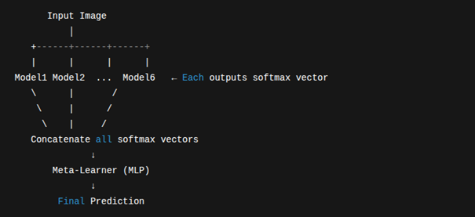

# Facial Emotion Recognition (FER) with Ensemble & Meta-Learning

This project was developed as part of the **Artificial Intelligence Methods** course at **Ege University, Computer Engineering Department**.

## Project Overview
The goal of this project is to accurately classify facial images into one of seven emotion categories: **Angry, Disgust, Fear, Happy, Neutral, Sad, and Surprise**. Using the **FER-2013** dataset, we implemented a robust solution by combining multiple Convolutional Neural Network (CNN) architectures with advanced decision fusion techniques.

### Key Features
* **Ensemble Learning:** Integration of 6 diverse CNN architectures.
* **Meta-Learning:** A Multi-Layer Perceptron (MLP) meta-learner trained to intelligently combine model outputs.
* **Hard Test-Time Augmentation (TTA):** Robust inference using 5+ augmentations per image.
* **Attention Mechanisms:** Utilization of CBAM and Squeeze-and-Excitation (SE) modules to focus on key facial regions.

---

## System Architecture
Our proposed method follows a multi-stage workflow:
1. **Preprocessing:** Images are normalized, resized, and augmented using techniques like MixUp and CutMix.
2. **Base Models:** Six separate models extract diverse features from grayscale and RGB-converted images.
3. **Meta-Learner Fusion:** Softmax outputs from all models are concatenated and passed to an MLP to produce the final prediction.

### Base Models & Performance
| Model | Input Type | Accuracy |
| :--- | :--- | :--- |
| **ResNet18 + CBAM** | Gray | ~66.8% |
| **ResNet34 + SE** | Gray | ~67.9% |
| **DenseNet121** | RGB | ~68.5% |
| **EfficientNetB0** | RGB | ~69.3% |
| **ConvNeXt-Tiny** | RGB | **~70.8%** |
| **Custom CNN** | Gray | ~61.2% |

**Final Ensemble Accuracy (with Meta-Learner & TTA): 72.78%**.

---

## Tech Stack & Environment
* **OS:** Ubuntu 22.04.
* **Language:** Python 3.10.
* **Framework:** PyTorch.
* **Libraries:** Albumentations, Scikit-learn, Pandas, NumPy, Matplotlib.
* **Hardware:** NVIDIA GTX 1660 SUPER.

---

## Results
The model excels in recognizing emotions while handling the inherent class imbalances of the FER-2013 dataset:
* **Happy:** 90%
* **Surprise:** 84%
* **Neutral:** 74%
* **Disgust:** 68%
* **Angry:** 64%
* **Sad:** 62%
* **Fear:** 54%

---

## References
* Goodfellow, I., Bengio, Y., & Courville, A. (2016). Deep Learning.
* Woo, S., et al. (2018). CBAM: Convolutional Block Attention Module.
* Kaggle. (2013). FER-2013 Dataset.
